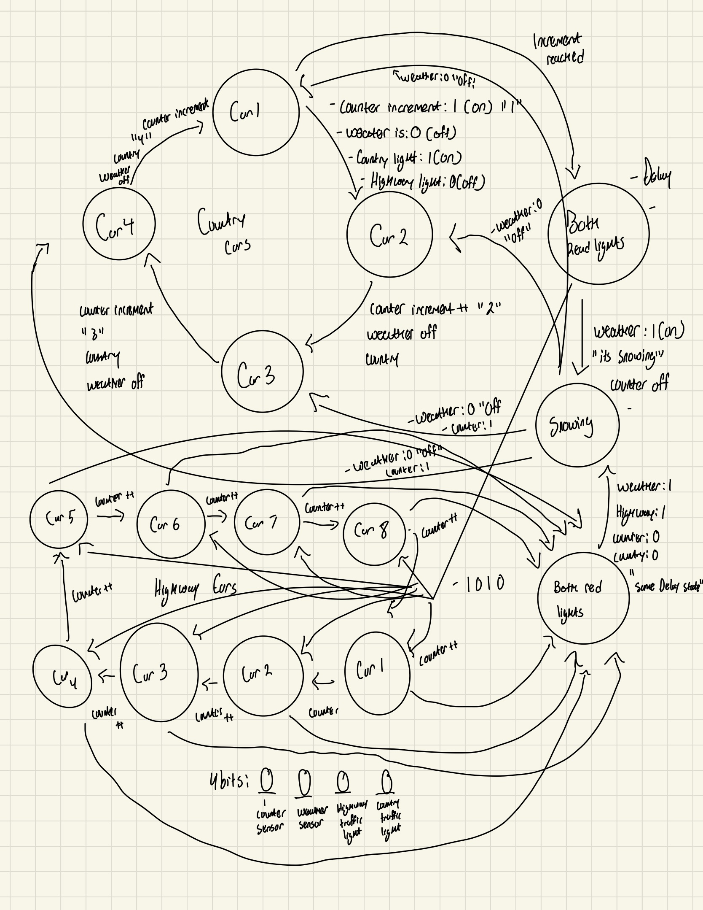

# Final Project 
## Intro:
This project will be implementing a system that can help control the flow of traffic at an unspecified intersection . We know that the intersection has a highway and country road and has encoders  acting as a counter,weather and one that stops the lights . Some rules that we will follow for the design specifically will be that after it snows we prioritize the highway and that after it snows we stop both lights first to minimize the risk of collisions. 

> ## Description 
> In this project we are monitoring a bustling intersection with two roads one being a highway and the other a country road . There are three sensors that are used to control two traffic lights which only have two options : green light for 'GO' and red light for 'STOP'. The first sensor is a counting sensor that counts the amount of cars passing by in either direction , second is a weather sensor that detects whether it's snowing or not and last a sensor enable . Having my inputs being the the two sensors and two lights and the output being how many cars have passed to change the lights .
> Since the highway is typically going to be busier then the country road for every  8 cars on the highway the passes by the lights will change and for every 4 cars that pass on the country road the light will change  . When the weather sensor changes the counting sensor will cease until it stops snowing .
>
>##  State Diagram 
> 

## Documentation of design 

## BOM
Wires, 3 LEDs, ANDs, Ors, Nots, resistors, breadboard, 2 flip flops 

## Documentation of physical approach 
For the physical implementation I used 2 flip-flops to define about 8 states .

Some test cases used for the physical implementation were primarily focused to see if we can properly transition from state to state accurately:

Can we go from highway to country after the counter limit was reached .
Can we go from the country to the highway after the counter limit was reached .
Can we go from high way to snowing after weather was enabled 
Can we go from country to snowing after weather was enabled 
Can we go from snowing back to highway regardless of where we came from 
You should only be able to delay from snow because we need to minimize accidents .
We automatically go to delay transitioning between highway and country 
We should never be able to have two lights on simultaneously.

## SV Program 

## Analysis
> 
> ## Summary
> Some considerations i took into account while implementing my state diagram was having 4 bits that can be either 1 or 0.  And building around that idea to construct and system that can manage the flow of traffic and take into account the difference between a country road and a highway . I chose to use that states as cars to find a way to keep track the amount of cars going through each road and having the counter being the main driving force between each and every state . Other states were labeled as the delay to signify both traffic lights turning red to avoid any accidents before changing either light to green or entering another section of the diagram .Snowing was another state that ceased counting and kept track of the counter before it was disabled .

## Conclusiom 

For the implementation of the traffic intersection project I used a 3 bit microcontroller that properly controls the flow of traffic . Through the use of flip-flops a system was created when  every 4 cars on the highway passed by it would switch to both red lights as a pause and give the country road the right of way . It also takes into account weather conditions on any given road and pauses all traffic when it is snowing to avoid injury . Once the snow storm is over it will automatically prioritize the cars on the highway as it is busier and has many people on it when compared to the country road .Through the use of this implementation we can make this intersection safer for everyone, business men/women and country folk alike .
